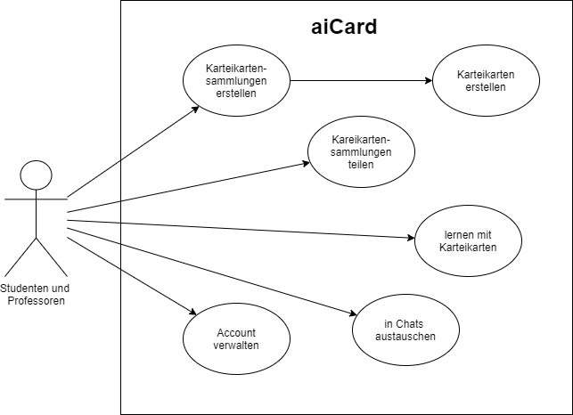
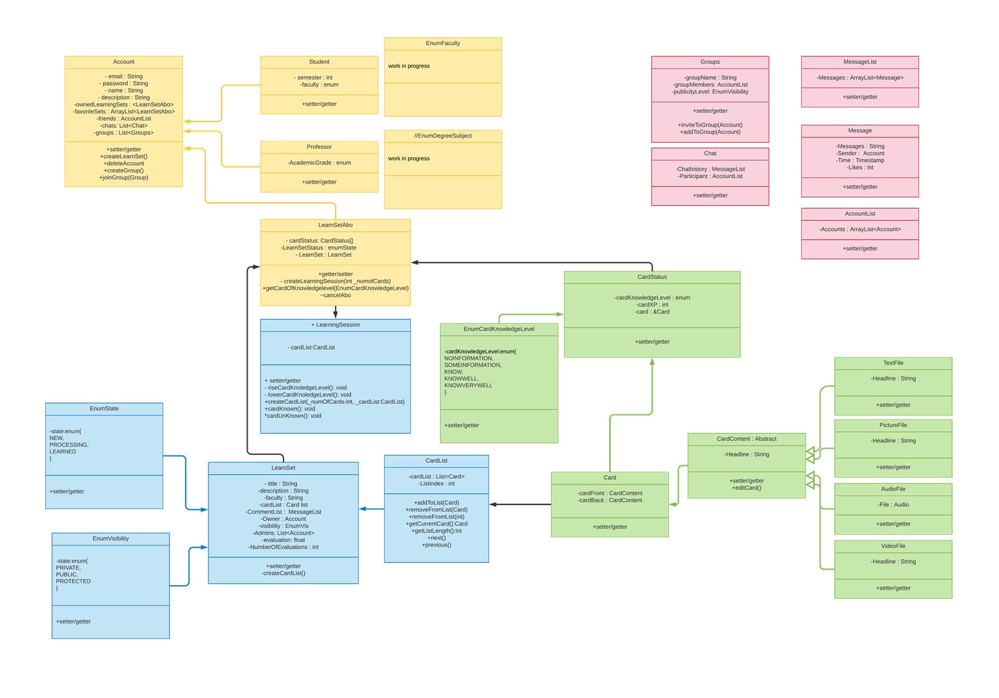
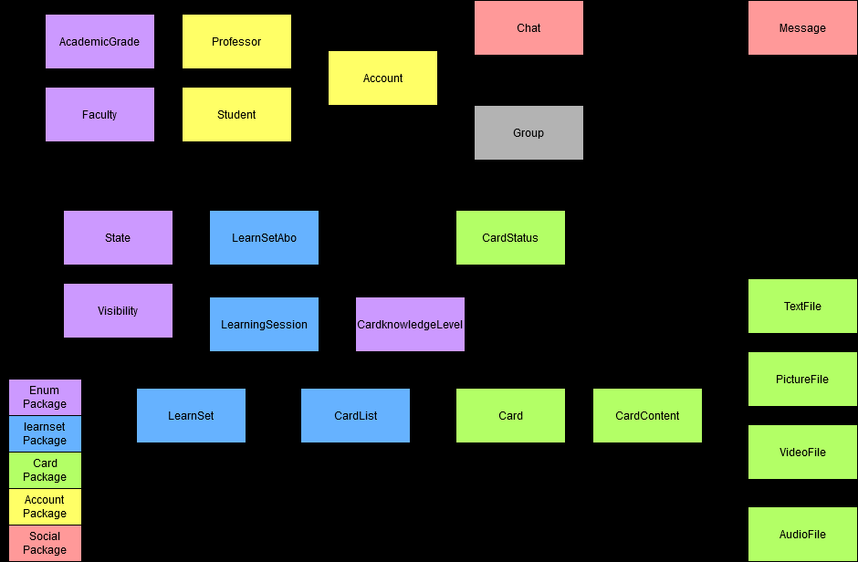

# AICard
[](https://github.com/fh-erfurt/aiCard/actions)

## Dokumentation
Als Gruppenprojekt für die Veranstaltungen Java 1 und Java 2 wurde bzw. wird das im Weiteren beschriebene 
Multiuser-Lernkartensystem implementiert.

<details>
<summary> Allgemeine Projektübersicht </summary>
<br>

### Projektteam
Das Team besteht aus 5 Mitgliedern, alle aus der Vertiefungsrichtung Ingenieursinformatik:
* **Clemens Berger** - [Profil](https://github.com/ClemensESB)
* **Antonio Blechschmidt** - [Profil](https://github.com/AntonioBlechschmidt)
* **Martin Kühlborn** - [Profil](https://github.com/KhbrnDev)
* **Daniel Michel** - [Profil](https://github.com/DanielMichel350)
* **Amine Semlali** - [Profil](https://github.com/AmineSemlali)

### JavaDoc

HIER LINK EINFÜGEN!!

### Projektbeschreibung
Ziel des Projektes ist es, ein Multiuser-Kartenlernsystem für Studierende und Lehrende als Pilotprojekt an der FH Erfurt
zu entwickeln. Um das System nutzen zu können, müssen die Studierenden und Lehrenden einen Account erstellen. Hierzu
sind die Angaben Hochschul-Email und Passwort zwingend erforderlich, da diese zum Login benötigt werden. Studierende
können sich ihrem Studienfach zuordnen. Alle können LearnSets anlegen. LearnSets sind eine Gruppierung von maximal 200 digitalen
Karten aus einem bestimmten Fachbereich. Ein LearnSet muss beim Erstelen benannt und beschrieben werden. 
LearnSets können als Sichtbarkeit entweder PRIVATE (nur der erstellende Account kann sie sehen und abonnieren), 
PUBLIC (alle können sie sehen und abonnieren) oder PROTECTED (der erstellende Account und alle Accounts in seiner
Freundesliste kann sie sehen und abonnieren) haben. Jede Karte im LearnSet besteht aus zwei Seiten, einer Vorder- und
einer Rückseite.
<br>
User können über eine Suchfunktion LearnSets finden, die für sie sichtbar sind, und sie zu ihrem Account hinzufügen
(abonnieren). Von abonnierten LearnSets aus können Abfragen gestartet werden, sogenannte Learning-Sessions. Beim Erstellen 
einer Learning-Session kann man auswählen, wie viele Karten in einer Abfrage abgefragt werden sollen: 10, 20, 30, 40 oder 50. Es werden automatisiert in einer LearningSession genau die Karten abgefragt, die über den niedrigsten Status verfügen.
Wird ein LearnSet neu abonniert, wird der Status jeder Karte auf diesen niedrigsten Wert gesetzt. Während einer LearningSession ist von dem Nutzer selbst anzugeben, ob er die Karte gewusst hat oder nicht. Anhand dieser Angabe wird der Status der Karte aktualisiert.
<br>
Accounts können Chats mit anderen Accounts erstellen und sich hierüber austauschen. Dem Austausch unter den Accounts dient
des Weiteren die Möglichkeit, LearnSets zu kommentieren und sie zu bewerten.

<br>
Ursprünglich wurde darüber hinaus überlegt, dem System eine Funktion hinzuzufügen, die es den Accouts ermöglicht, Gruppen mit anderen Accounts zu bilden und hierüber gemeinsam LearnSets zu erstellen.
Diese Funktion wurde jedoch nicht umgesetzt, da die Gruppe sich dazu entschied, lieder einen Fokus auf die Qualität der Kernfunktionen des Kartenlernsystems zu legen.
Gänzlich verabschiedet haben wir uns von dieser Funktion jedoch noch nicht - eventuell erfolgt eine Implementierung in Java 2.
Das bisher entstandene Grundgerüst der Gruppen-Klasse wurde im Projekt auskommentiert und alle vorhandenen Klassen wurden so gestaltet, dass eine Erweiterung des Gesamtsystems um eine Gruppen-Funktion ohne weiteres möglich ist. 



### Codestyle
- The gaol of this document is to ensure a consistent CodeStyle throughout the project
- Violations of this CodyStyle are allowed if it enhances readability

#### Naming conventions
- All names should be written in English
- Class names must be PascalCase <br>
    ```
    ClassName, CardList
    ```
- Variable names must be camelCase <br>
    ```
    int numberOfCard;   // not: int NumberOfcard;
    String carName;     // not: String Carname;
    ```
- Underscores are banned from all names
    ```
    // INCORRECT
    int number_of_cars;
    String car_Name;
  ```
- Method names must be camelCase
    ```
    getNumberOfCars();          // not: GetNumberOfCars();
    calculateEverageSales();    // not: Calculateeveragesales();
    ``` 
- Parametes must start with an _underline
    ```
   public void methodeName(_Parameter);
  ```
#### Files and Folders
- Java file names must be PascalCase
    ```
    Car.java        // not: car.java
    SportsCar.java  // not: sportsCard.java
    ``` 
- Java test files names must be Pascal Case
    ```
    CarTest.java        // not: testcar.java
    SportsCarTest.java  // not: TestsportsCardtesting.java
    ``` 
    - their location must be in the same package structure in the test branch as the implementation

- package names must be lower case
    - packages in java and test folder must mirror each other

#### Layout
- Block Layout for curly brackets
    ```
    public class TestClass
    {
        if (1 < 0)
        {
            // Do something
        }
    
        for (int index = 0; index < 10 ; index++)
        {
            // Do something
        }
    
    }
    ```

#### Comments
- every class must have a comment with its description and its author in JavaDocStyle
- every membervariable must have a comment explaining its use in JavaDocStyle
- complex methods must be commented in JavaDocStyle
- short comments in methods are appreciated
- TODO comments are appreciated
    ```
    /**
    * JavaDocStyle comment example
    * 
    * @author: 
    */
    
    // short comment example
    
    
    // TODO: example
  
  
    ```

</details>
<details>
<summary> Zentrale Architekturentscheidungen </summary>
<br>
Im laufe der Projektarbeit mussten in der Gruppe viele Entscheidungen getroffen werden hinsichtlich der Architektur des Systems,
es musste geklärt werden, wie die Klassen in Packages aufgeteilt werden sollen und welche Funktionalität in welcher Klasse am besten aufgehoben ist.
Die Finale Struktur, die zum Zeitpunkt der Abgabe des Projekts für Java 1 vorliegt, ist das Ergebnis dieses Prozesses,
der mit folgendem Klassendiagramm, das auch in der Zwischenpräsentation des Projektes vorgestellt wurde, begann:



Am (vorläufigen) Ende dieses Prozesses steht nun das folgende Klassendiagramm, welches um eine bessere Übersicht zu
gewährleisten hier in verkürzter Version nur mit Klassennamen realisiert ist:



Die zentralen Entscheidungen, die zu diesem Ergebnis geführt haben, werden im Folgenden, geordnet nach Packages, dokumentiert.
Für die Dokumentation der konkreten Implementierung der Klassen ist bitte die unter Allgemeine Projektübersicht verlinkte JavaDoc sowie der Code selbst zu konsultieren.

### Enums
Das Package Enums kam im Arbeitsprojekt als Package neu hinzu. Ursprünglich war geplant, die Enums funktional an die Packages
anzugliedern, wo sie benötigt werden. Wir haben uns jedoch dazu entschieden, alle Enums in ein eigenes Package auszulagern, 
da dies die Projektstruktur übersichtlicher gestaltet.

### Account
Das Package Account erfüllt die Funktion der Nutzerverwaltung. Von Anfang an klar war, dass für diese Aufgabe drei Klassen zentral sind:
die Klasse Account, und, da es in einem Hochschul-Lernsystem zwei Typen von Accounts geben muss, die beiden Subklassen Professor und Student, 
die die Grundfunktionalitäten von Account erben, jedoch Besonderheiten für Lehrende und Lernende abbilden können.
Wo wir im Entwicklungsprozess eine Entscheidung treffen mussten, ist bei der Zuordnung von LernSetAbo und LearningSession:
beide Klassen enthalten zwar Informationen, die klar einem Account zugeordnet sind, da ein LearnSetAbo Repräsentation eines LearnSets und seiner Account spezifischen Informationen,
wie der akutelle Lernstand, ist. Eine LearningSession wird ebenfalls immer aus einem LearnSetAbo in einem Account gestartet.
Entsprechend könnten LearnSetAbo sowie LearningSession ebenso gut im Package Account enthalten sein. 
Die Gruppe entschied sich dennoch dazu, beide Klassen in das Package LearnSet zu inkludieren, um alle direkt mit dem LearnSet
zusammenhängenden Klassen, die die Funktion des Anlegens und Lernens von Inhalten erfüllen, zentral in einem Package zu haben. 

### Learnset
Die im vorherigen Abschnitt begründete Entscheidung führt dazu, dass das Package Learnset mehr Funktionen beinhaltet, nämlich all diejenigen, 
die unmittelbar mit der Funktionalität "Lernen" unseres Lernkartensystems zusammenhängen.
Dies beinhaltet auch die Klasse CardList, die in allen anderen Klassen des Package lernsets benötigt wird. Sie ist eine Liste von Karten,
angereichert durch einen Index, der erhöht und verringert werden kann, und so die aktuelle Karte anzeigt,
beispielsweise die Karte, die gerade in einer LearningSession angezeigt wird.

### Card
Wenn auch zum Lernbereich gehörend, haben wir uns dazu entschlossen, alle Funktionalitäten, die direkt mit einzelnen Karten zusammenhängen,
in ein weiteres Package auszulagern, um die einzelnen Packages kompakt zu halten. Bis auf die Auslagerung der Enums stand dieses Package in seinem
Umfang von Anfang an.

### Social
Im Package Social mussten am meisten Entscheidungen getroffen werden, auch, weil von Anfang an der Fokus unserer Arbeit
auf dem Bereich des Lernens lag und weniger auf dem Bereich der Interaktion zwischen Accounts. Dennoch konnten wir letztendlich 
auch aus diesem Bereich einige Funktionalitäten implementieren, wie Chats und dem Kommentieren von LearnSets. Von anderen
Klassen mussten wir uns schließlich dennoch trennen. Von der Klasse Groups trennten wir uns, da die Implementierung der 
Funktion, Gruppen zu bilden, innerhalb eines Semesters nicht so möglich gewesen wäre, dass sie unseren Ansprüchen genügt hätte.
Und wir trennten uns von zwei weiteren Klassen, die ursprünglich im Package Social enthalten waren: MessageList und AccountList.
Hier stellten wir während der Implementierung fest: wir brauchen diese Klassen nicht, denn wir hatten an diese Klassen keine
Anforderungen, die nicht auch die Java eigene Klasse ArrayList erfüllen würde. Die logische Konsequenz war es, diese Klassen aus unserem Projekt zu löschen.

</details>