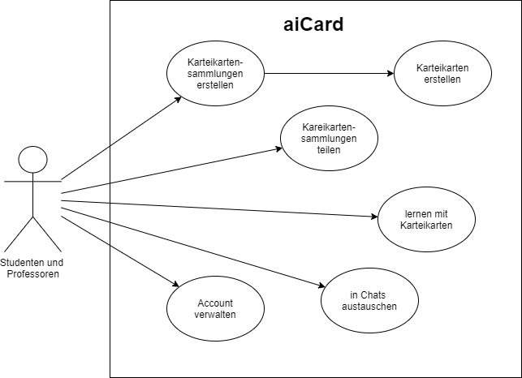
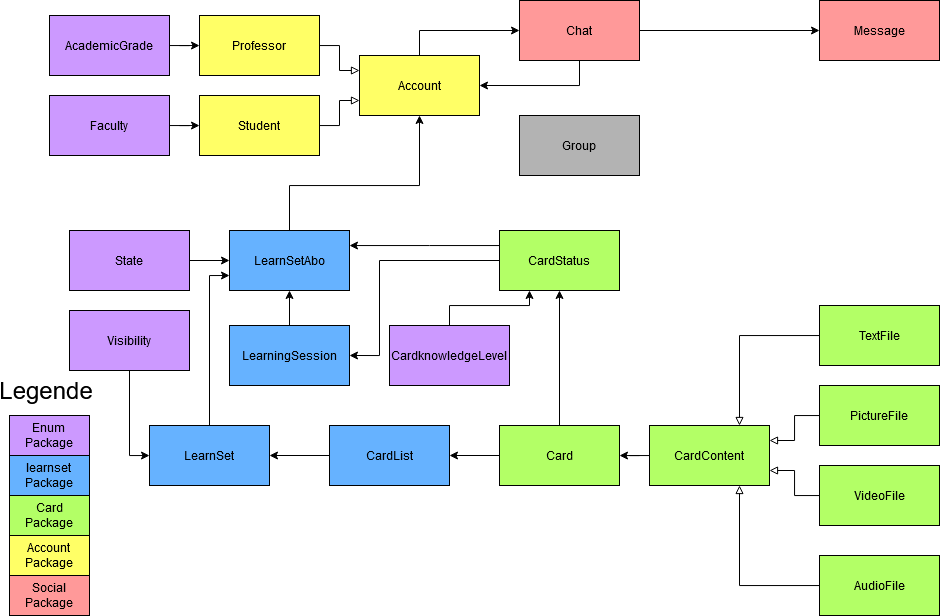

# AICard
[](https://github.com/fh-erfurt/aiCard/actions)

## Dokumentation
Als Gruppenprojekt für die Veranstaltungen Java 1 und Java 2 wurde bzw. wird das im Weiteren beschriebene 
Multiuser-Lernkartensystem implementiert.

### Allgemeine Projektübersicht

<details>
<summary>Projektteam</summary>
<br>

Das Team besteht aus 5 Mitgliedern, alle aus der Vertiefungsrichtung Ingenieursinformatik:
* **Clemens Berger** - [Profil](https://github.com/ClemensESB)
* **Antonio Blechschmidt** - [Profil](https://github.com/AntonioBlechschmidt)
* **Martin Kühlborn** - [Profil](https://github.com/KhbrnDev)
* **Daniel Michel** - [Profil](https://github.com/DanielMichel350)
* **Amine Semlali** - [Profil](https://github.com/AmineSemlali)
</details>

<details>
<summary>JavaDoc</summary>
<br>
HIER LINK EINFÜGEN!!

</details>


<details>
<summary>Projektbeschreibung</summary>
<br>

Ziel des Projektes ist es, ein Multiuser-Kartenlernsystem für Studierende und Lehrende als Pilotprojekt an der FH Erfurt
zu entwickeln. Um das System nutzen zu können, müssen die Studierenden und Lehrenden einen Account erstellen. Hierzu
sind die Angaben Hochschul-Email und Passwort zwingend erforderlich, da diese zum Login benötigt werden. Studierende
können sich ihrem Studienfach zuordnen. Alle können LearnSets anlegen. LearnSets sind eine Gruppierung von maximal 200 digitalen
Karten aus einem bestimmten Fachbereich. Ein LearnSet muss beim Erstelen benannt und beschrieben werden. 
LearnSets können als Sichtbarkeit entweder PRIVATE (nur der erstellende Account kann sie sehen und abonnieren), 
PUBLIC (alle können sie sehen und abonnieren) oder PROTECTED (der erstellende Account und alle Accounts in seiner
Freundesliste kann sie sehen und abonnieren) haben. Jede Karte im LearnSet besteht aus zwei Seiten, einer Vorder- und
einer Rückseite.
<br>
User können über eine Suchfunktion LearnSets finden, die für sie sichtbar sind, und sie zu ihrem Account hinzufügen
(abonnieren). Von abonnierten LearnSets aus können Abfragen gestartet werden, sogenannte Learning-Sessions. Beim Erstellen 
einer Learning-Session kann man auswählen, wie viele Karten in einer Abfrage abgefragt werden sollen: 10, 20, 30, 40 oder 50. Es werden automatisiert in einer LearningSession genau die Karten abgefragt, die über den niedrigsten Status verfügen.
Wird ein LearnSet neu abonniert, wird der Status jeder Karte auf diesen niedrigsten Wert gesetzt. Während einer LearningSession ist von dem Nutzer selbst anzugeben, ob er die Karte gewusst hat oder nicht. Anhand dieser Angabe wird der Status der Karte aktualisiert.
<br>
Accounts können Chats mit anderen Accounts erstellen und sich hierüber austauschen. Dem Austausch unter den Accounts dient
des Weiteren die Möglichkeit, LearnSets zu kommentieren und sie zu bewerten.

<br>
Ursprünglich wurde darüber hinaus überlegt, dem System eine Funktion hinzuzufügen, die es den Accouts ermöglicht, Gruppen mit anderen Accounts zu bilden und hierüber gemeinsam LearnSets zu erstellen.
Diese Funktion wurde jedoch nicht umgesetzt, da die Gruppe sich dazu entschied, lieder einen Fokus auf die Qualität der Kernfunktionen des Kartenlernsystems zu legen.
Gänzlich verabschiedet haben wir uns von dieser Funktion jedoch noch nicht - eventuell erfolgt eine Implementierung in Java 2.
Das bisher entstandene Grundgerüst der Gruppen-Klasse wurde im Projekt auskommentiert und alle vorhandenen Klassen wurden so gestaltet, dass eine Erweiterung des Gesamtsystems um eine Gruppen-Funktion ohne weiteres möglich ist. 


</details>

<details>
<summary>Codestyle</summary>
<br>


- The gaol of this document is to ensure a consistent CodeStyle throughout the project
- Violations of this CodyStyle are allowed if it enhances readability

#### Naming conventions
- All names should be written in English
- Class names must be PascalCase <br>
    ```
    ClassName, CardList
    ```
- Variable names must be camelCase <br>
    ```
    int numberOfCard;   // not: int NumberOfcard;
    String carName;     // not: String Carname;
    ```
- Underscores are banned from all names
    ```
    // INCORRECT
    int number_of_cars;
    String car_Name;
  ```
- Method names must be camelCase
    ```
    getNumberOfCars();          // not: GetNumberOfCars();
    calculateEverageSales();    // not: Calculateeveragesales();
    ``` 
- Parametes must start with an _underline
    ```
   public void methodeName(_Parameter);
  ```
#### Files and Folders
- Java file names must be PascalCase
    ```
    Car.java        // not: car.java
    SportsCar.java  // not: sportsCard.java
    ``` 
- Java test files names must be Pascal Case
    ```
    CarTest.java        // not: testcar.java
    SportsCarTest.java  // not: TestsportsCardtesting.java
    ``` 
    - their location must be in the same package structure in the test branch as the implementation

- package names must be lower case
    - packages in java and test folder must mirror each other

#### Layout
- Block Layout for curly brackets
    ```
    public class TestClass
    {
        if (1 < 0)
        {
            // Do something
        }
    
        for (int index = 0; index < 10 ; index++)
        {
            // Do something
        }
    
    }
    ```

#### Comments
- every class must have a comment with its description and its author in JavaDocStyle
- every membervariable must have a comment explaining its use in JavaDocStyle
- complex methods must be commented in JavaDocStyle
- short comments in methods are appreciated
- TODO comments are appreciated
    ```
    /**
    * JavaDocStyle comment example
    * 
    * @author: 
    */
    
    // short comment example
    
    
    // TODO: example
  
  
    ```
</details>

<details>
<summary>Verwendete Programme</summary>
<br>

* [IntelliJ](https://www.jetbrains.com/de-de/idea/) - IDE für JAVA
* [Discord](https://discord.com/) - Gruppenchat und Meetings
* [WebEx](https://www.webex.com/de/index.html) - Meetings, wenn der geteilte Bildschirm eine bessere Auflösung haben sollte
* [lucidchart](https://www.lucidchart.com) - Erstellung von Diagrammen
* [Office](https://www.office.com/) - Erstellung von Präsentationen
* [GitHub](https://github.com/) - Versionsverwaltung

</details>

### Zentrale Architekturentscheidungen
<details>
<summary> Übersicht </summary>
<br>
Im Laufe der Projektarbeit mussten in der Gruppe viele Entscheidungen getroffen werden hinsichtlich der Architektur des Systems,
es musste geklärt werden, wie die Klassen in Packages aufgeteilt werden sollen und welche Funktionalität in welcher Klasse am besten aufgehoben ist.
Die finale Struktur, die zum Zeitpunkt der Abgabe des Projekts für Java 1 vorliegt, ist das Ergebnis dieses Prozesses,
der mit folgendem Klassendiagramm, das auch in der Zwischenpräsentation des Projektes vorgestellt wurde, begann:


Am (vorläufigen) Ende dieses Prozesses steht nun das folgende Klassendiagramm, welches um eine bessere Übersicht zu
gewährleisten hier in verkürzter Version nur mit Klassennamen realisiert ist:



Die zentralen Entscheidungen, die zu diesem Ergebnis geführt haben, werden im Folgenden, geordnet nach Packages, dokumentiert.
Für die Dokumentation der konkreten Implementierung der Klassen ist bitte die unter Allgemeine Projektübersicht verlinkte JavaDoc sowie der Code selbst zu konsultieren.
</details>

<details>
<summary>Enums</summary>
<br>
Das Package Enums kam im Arbeitsprojekt als Package neu hinzu. Ursprünglich war geplant, die Enums funktional an die Packages
anzugliedern, wo sie benötigt werden. Wir haben uns jedoch dazu entschieden, alle Enums in ein eigenes Package auszulagern, 
da dies die Projektstruktur übersichtlicher gestaltet.
</details>

<details>
<summary>Account</summary>
<br>
Das Package Account erfüllt die Funktion der Nutzerverwaltung. Von Anfang an klar war, dass für diese Aufgabe drei Klassen zentral sind:
die Klasse Account, und, da es in einem Hochschul-Lernsystem zwei Typen von Accounts geben muss, die beiden Subklassen Professor und Student, 
die die Grundfunktionalitäten von Account erben, jedoch Besonderheiten für Lehrende und Lernende abbilden können.
Wo wir im Entwicklungsprozess eine Entscheidung treffen mussten, ist bei der Zuordnung von LernSetAbo und LearningSession:
beide Klassen enthalten zwar Informationen, die klar einem Account zugeordnet sind, da ein LearnSetAbo Repräsentation eines LearnSets und seiner Account spezifischen Informationen,
wie der akutelle Lernstand, ist. Eine LearningSession wird ebenfalls immer aus einem LearnSetAbo in einem Account gestartet.
Entsprechend könnten LearnSetAbo sowie LearningSession ebenso gut im Package Account enthalten sein. 
Die Gruppe entschied sich dennoch dazu, beide Klassen in das Package LearnSet zu inkludieren, um alle direkt mit dem LearnSet
zusammenhängenden Klassen, die die Funktion des Anlegens und Lernens von Inhalten erfüllen, zentral in einem Package zu haben. 
</details>

<details>
<summary>Learnset</summary>
<br>
Die im vorherigen Abschnitt begründete Entscheidung führt dazu, dass das Package Learnset mehr Funktionen beinhaltet, nämlich all diejenigen, 
die unmittelbar mit der Funktionalität "Lernen" unseres Lernkartensystems zusammenhängen.
Dies beinhaltet auch die Klasse CardList, die in allen anderen Klassen des Package lernsets benötigt wird. Sie ist eine Liste von Karten,
angereichert durch einen Index, der erhöht und verringert werden kann, und so die aktuelle Karte anzeigt,
beispielsweise die Karte, die gerade in einer LearningSession angezeigt wird.

</details>
<details>
<summary>Card</summary>
Wenn auch zum Lernbereich gehörend, haben wir uns dazu entschlossen, alle Funktionalitäten, die direkt mit einzelnen Karten zusammenhängen,
in ein weiteres Package auszulagern, um die einzelnen Packages kompakt zu halten. Bis auf die Auslagerung der Enums stand dieses Package in seinem
Umfang von Anfang an.
</details>

<details>
<summary>Social</summary>
<br>
Im Package Social mussten am meisten Entscheidungen getroffen werden, auch, weil von Anfang an der Fokus unserer Arbeit
auf dem Bereich des Lernens lag und weniger auf dem Bereich der Interaktion zwischen Accounts. Dennoch konnten wir letztendlich 
auch aus diesem Bereich einige Funktionalitäten implementieren, wie Chats und dem Kommentieren von LearnSets. Von anderen
Klassen mussten wir uns schließlich dennoch trennen. Von der Klasse Groups trennten wir uns, da die Implementierung der 
Funktion, Gruppen zu bilden, innerhalb eines Semesters nicht so möglich gewesen wäre, dass sie unseren Ansprüchen genügt hätte.
Und wir trennten uns von zwei weiteren Klassen, die ursprünglich im Package Social enthalten waren: MessageList und AccountList.
Hier stellten wir während der Implementierung fest: wir brauchen diese Klassen nicht, denn wir hatten an diese Klassen keine
Anforderungen, die nicht auch die Java eigene Klasse ArrayList erfüllen würde. Die logische Konsequenz war es, diese Klassen aus unserem Projekt zu löschen.
</details>


### Lessons Learned

Der Entstehungsprozess dieses Projektes wurde auch begleitet von einem kontinuierlichen Lernprozess aller Gruppenmitglieder.
Da wir mit unterschiedlichen Vorkenntnissen in das Projekt starteten, konnten wir vor allem auch viel voneinander lernen.
Unsere Lessons Learned seien hier kurz zusammengefasst, gegliedert in den fachlichen Bereich und den sozialen Bereich.

<details>
<summary> 
Fachliche Lessons Learned
</summary>
- Die größte Schwierigkeit bei diesem Projekt war das Umdenken von einer datenbankbasierten Logik: An der FH Erfurt lernen 
wir Softwaretechnik am Beispiel von Datenbanken, und mit diesem Denkmuster startete auch unsere Gruppe in das Projekt.
- Wir haben Java gelernt: trotz unterschiedlicher Vorkenntnisse haben am Ende doch alle etwas dazugelernt und ihre Kenntnisse
  in Java vertiefen können.
- Tests helfen sehr bei der Programmierung.
- Wir haben GitHub gelernt: Anfangs hatten wir einige Probleme beim Arbeiten mit GitHub, die wir jedoch alle gemeinsam lösen konnten.
</details>
<details>
<summary>
Soziale Lessons Learned
</summary>
- Gruppenarbeit ist kompliziert, weil es viel Reden und Abstimmungen erfordert. Gerade im Online-Semester, wenn man sich nicht sowieso 
um die gemeisamen Veranstaltungen herum auf dem Campus trifft, ist dies eine besondere Herausforderung, die wir gemeinsam gemeistert haben.
- Wo viel miteinander geredet wird, ist eine gute und eindeutige Protokollführung sehr wichtig, damit Entscheidungen klar 
  dokumentiert sind.
- Wir sind mit Problemen nie alleine: egal welche (fachlichen) Probleme auftraten, es fand sich immer (mindestens) ein
  anderes Gruppenmitglied, das Abhilfe schaffen konnte. Egal, ob während den gemeinsamen Meetings oder einfach so zwischendurch
      in unserem Gruppenchat.
- Wir brauchen keine Sanktionen: wir hatten uns zu Beginn des Projektes, entgegen den Empfehlungen von Seiten des Dozenten,
  dazu entschieden, keine Sanktionen festzulegen. Hieran haben wir bis zum Ende festgehalten und haben gute Erfahrungen gemacht.
</details>

### Protokolle

<details>
<summary>Meeting 5. November 2020</summary>
<br>

Protokoll

Meeting

Datum:05.11.20
Uhrzeit:18:00-19:20 Uhr


Teilnehmer:
Amine Semlali
Clemens Berger
Daniel Michel
Martin Kühlborn
Antonio Blechschmidt (Protokollant)


Inhalt:
regelmäßige Treffen Donnerstag 19 Uhr
keine Sanktionen für negative Verhalten, Überlegungen übe ein Belohnungssytem
Codstyle wird grob übernommen von Herr Sahms C++ Codestyle
Themenbesprechung:
Zahnarztorganisationssoftware
Burgerladenbestellsoftware
Karteikartensystem (gewähltes Thema)
Name für Projekt: aiCard
erstellen des Repository
testen der Funktionalitäten in GitHub


Aufgaben:
alle Mitglieder:
GitHub und IntelliJ zum laufen bringen
Beschreibung schreiben
Amine:
-
Clemens:
-
Daniel:
-
Martin:
Codestyle Sheet organisieren
Antonio:
Protokoll auf GitHub hochladen
</details>

<details>
<summary>Meeting 12. November 2020</summary>
<br>
Protokoll

Meeting

Datum:12.11.20
Uhrzeit:19:00 - 21:30Uhr


Teilnehmer:
Amine Semlali
Clemens Berger
Daniel Michel (Zukunfts Protokoll)
Martin Kühlborn (Protokollant)
Antonio Blechschmidt (verspätet)


Inhalt:
Projektbeschreibung überarbeiten und Festlegung der Projektideen
Erstellung der PowerPoint für die Präsentation am 16.11.20


Aufgaben:
alle Mitglieder:

    Amine:
        -Präsentation Folie 6
    Clemens:
        -Präsentation Folie 3
    Daniel:
        -Description verschönern 
		-Präsentation Folie 4
    Martin:
		-Präsentation Folie 5
    Antonio:
		-Präsentation Folie 1 und 2


</details>


<details>
<summary>Meeting 19. November 2020</summary>
<br>
Protokoll

Meeting

Datum:19.11.20
Uhrzeit:19:00 - 22:00Uhr


Teilnehmer:
Amine Semlali
Clemens Berger (Protokollant)
Daniel Michel (Verspätet)
Martin Kühlborn
Antonio Blechschmidt


Inhalt:
Klassen und Methoden Identifikation


Aufgaben:
alle Mitglieder:
Die denken Nach und Atmen

    Amine:
        Hat Link für UML Diagramm
        Card
    Clemens:
        Skipper
    Daniel:
        LearnSet
    Martin:
		Account
    Antonio:
		LearningSession


</details>

<details>
<summary>Meeting 26. November 2020</summary>
<br>
Protokoll

Meeting

Datum: 26.11.2020
Uhrzeit: 19:00

Teilnehmer:
Amine Semlali
Clemens Berger
Daniel Michel (Protokoll)
Martin Kühlborn
Antonio Blechschmidt

Inhalt:
- Aktueller Stand Klassen
- Skipper-Problem
- Dokumentation
- Ziele bis nächste Woche

Status:
- LearnSet Status: Status, wenn nicht neu: Prozentzahl wird angezeigt

Dokumentation:
- 1. Foliensatz, Seite 14

Optionaler Termin bei Problemen: Montag Abend

ToDo:
- Klassen aufeinander abstimmen
- @Daniel Konstruktor LearnSet bezüglich State überarbeiten
- @Clemens neue Klasse CardList
- @all Code dokumentieren
- @Daniel Enums auslagern
- @Daniel Nachfragen, ob Rücksprache mit Dozent möglich

</details>

<details>
<summary>Meeting 3. Dezember 2020</summary>
<br>
Protokoll Meeting

Datum: 03.12.2020
Uhrzeit: 19:00

Teilnehmer:
Amine Semlali (Protokoll)
Clemens Berger
Daniel Michel
Martin Kühlborn
Antonio Blechschmidt

Inhalt:
- Änderung Stand Klassen : Constructor Learnset ändern
- Fragen
- Ziele bis nächster Montag

Fragen für Montag :
-	Datenbank implementieren ?
-	Wie viele Klassen brauchen wir für 5 Personen ??
-	Jeweils eine Klasse für Vorder- und Rückseite der Karte ?
-	Fotos auf Karten ?
-   Welche Kriterien/Themen gibt es für die Zwischenpräsentation?
-   Enums als Klasse so ok?

ToDo: bis Montag 07.12.2020
- @Martin : Enum Klasse (Studiengänge)
- @alle : sich informieren über Logger Klasse + Test Fälle schreiben
-  sich über UML Diagramm informieren (wie macht man das richtig)

</details>

<details>
<summary>Meeting 7. Dezember 2020</summary>
<br>
Protokoll

Meeting

Datum:07.12.2020
Uhrzeit:19:00-21:30 Uhr


Teilnehmer:
Amine Semlali
Clemens Berger
Daniel Michel
Martin Kühlborn
Antonio Blechschmidt (Protokollant)


Inhalt:
Diskusion neue Klassen
(EnumKlassen)
State
CardKnowledgeLevel
Fakultäten
Studiengänge
(abstrakte)Karteninhalt - Superklasse der MedienKlassen
TextKartenSeite
AudioKartenSeite
BildKartenSeite
VideoKartenSeite
(abstrakte)AccountKlasse aufspalten
Student - Semester
Dozent - Administrative Funktionen
ChatKlasse mit ArrayKommentare
KommentareKlasse - für CardSets, Cards
LearningGroupKlasse - alle Können karten erstellen
LearnSet AccountArray für eine Whitelist
CardProgress - Knowlegdelevel, Status Auslagern in eine Klasse die Accountgebundene Card/Cardset festhält
Array mit Knowlegdelevel
Array mit Status
KlassenDiagramm in lucidchart (https://lucid.app/lucidchart/c7963545-5f00-46cf-94dc-b8bf282ebe30/edit?shared=true&page=HWEp-vi-RSFO#?folder_id=home&browser=icon )


Aufgaben:
alle Mitglieder:
Use-Cases überlegen
Amine:
Card
Clemens:
Learnset und Cardlist
Daniel:
Roter Bereich in lucidchard
Martin:
Gelber Bereich in lucidchard
Antonio:
LearningSeason
</details>

<details>
<summary>Meeting 10. Dezember 2020</summary>
<br>
Protokoll

Meeting

Datum:12+13.12.2020
Uhrzeit:19:00-21:00 Uhr


Teilnehmer:
Amine Semlali
Clemens Berger
Daniel Michel
Martin Kühlborn	(Protokollant)
Antonio Blechschmidt


Inhalt:
Präsentation erstellen für Zwischenpräsentation


Amine:
Card(6+7)
Antonio:
Lernsets(8+9)
Clemens:
Account(4+5, 12)
Martin:
Einleitung (1,2,3)
Daniel:
Chats(10+11)

@all:
Sonntag 19:00Uhr treffen und Präsentation durchsprechen
</details>

<details>
<summary>Meeting 17. Dezember 2020</summary>
<br>
Protokoll

Datum: 17. Dez 2020
Uhrzeit: 19:17 Uhr bis 19:47 Uhr

Anwesend: Alle :)

Themenverteilung:
CardStatus, Card und das rechts davon: Martin
LearnSet, LearnSetAbo, LearningSession: Daniel
Account, Student, Professor: Clemens
AccountList, Groups, LearnSetAbo: Amine
Antonio: Dokumentation

Code-Review-Kreis: Martin-> Daniel -> Clemens -> Amine -> Martin

und Antonio rewied alles

Nächste Meetings: Mittwochs, 19 Uhr

</details>

<details>
<summary>Meeting 23. Dezember 2020</summary>
<br>
Protokoll

Meeting

Datum:23.12.2020
Uhrzeit:19:00-19:38 Uhr


Teilnehmer:
Amine Semlali
Clemens Berger (Protokollant)
Daniel Michel
Martin Kühlborn
Antonio Blechschmidt


Inhalt:
LearnSetAbo
Problembesprechung


Aufgaben:
alle Mitglieder:
-
Amine:
-Message MessageList
Clemens:
-
Daniel:
-
Martin:
-
Antonio:
-
</details>

<details>
<summary>Meeting 30. Dezember 2020</summary>
<br>
Protokoll

Meeting

Datum:30.12.2020
Uhrzeit:19:00-19:38 Uhr


Teilnehmer:
Amine Semlali (Protokollant)
Clemens Berger
Daniel Michel
Martin Kühlborn
Antonio Blechschmidt


Inhalt:

Tests schreiben
Klassen vervollständigen


Aufgaben:

    alle Mitglieder: Eigene Klassen vervollständigen

    Amine: Tests für AccountList, Group, Chat, MessageList, Message

    Clemens: prüfen ob unser Code folgt die Javacode conventions, Erweiterung der Beschreibung

    Daniel: Tests für Learningsession und Learnsetabo

    Martin: Tests für Cardlist, Cardstatus und Learnset

    Antonio: Tests für Account und Funktionen

</details>

<details>
<summary>Meeting 7. Januar 2021</summary>
<br>
Meeting

Datum:07.01.2021
Uhrzeit:19 Uhr


Teilnehmer:
Amine Semlali
Clemens Berger
Daniel Michel
Martin Kühlborn
Antonio Blechschmidt (Protokollant)


Inhalt:
besprechen von Problemen
überarbeiten von Klassen anhand von fehlschlagenden Tests
account.creategroup() 2. Constructer
leanset.learnset() parameter übergeben
owner von Account übergeben
LearnsetAbo int für Evaluation

Aufgaben:
alle Mitglieder:
m_ für alle Member
Test schreiben
Amine:
-
Clemens:
-
Daniel:

    Martin:

    Antonio:

</details>

<details>
<summary>Meeting 14. Januar 2020</summary>
<br>
Meeting

Datum:14.01.2021
Uhrzeit:19 Uhr

Nächstes Treffen: Montag, 18.01.2021 19:00UHR

Teilnehmer:
Amine Semlali
Clemens Berger
Daniel Michel
Martin Kühlborn (Protokollant)
Antonio Blechschmidt


Inhalt:
Problembehandlung Chat
Gruppe wird nach hinten verschoben


Ideen für die Dokumentation:
Löschbare Nachrichten im Chat


Aufgaben:
alle Mitglieder:
- TODOS in eingenen Klassen bearbeiten
- Bei Gettern NullPointerExceptioons hinzufügen
-
Amine:
-
Clemens:
-
Daniel:

    Martin:

    Antonio:
</details>
<details>
<summary>Meeting 18. Januar 2021</summary>
<br>
Meeting

Datum:18.01.2021
Uhrzeit:19 Uhr

Nächstes Treffen:

Teilnehmer:
Amine Semlali
Clemens Berger
Daniel Michel (Protokollant)
Martin Kühlborn
Antonio Blechschmidt


Inhalt:
Dokumentation

Funktionalitäten, die wir noch brauchen:
- generelle Suchfunktion

Aufgabe:

Clemens überarbeitet die Klassen in Doku.
alle anderen: ToDos abarbeiten, Fehler in Tests beheben, weitere Tests schreiben, Code-Dokumentation in Englisch und
Java-Code-Standard
</details>

<details>
<summary>Meeting 21. Januar 2021</summary>
Meeting

Datum:18.01.2021
Uhrzeit:19 Uhr

Nächstes Treffen:

Teilnehmer:
Amine Semlali
Clemens Berger
Daniel Michel (Protokollant)
Martin Kühlborn
Antonio Blechschmidt


Inhalt:
Dokumentation

Funktionalitäten, die wir noch brauchen:
- generelle Suchfunktion

Aufgabe:

Clemens überarbeitet die Klassen in Doku.
alle anderen: ToDos abarbeiten, Fehler in Tests beheben, weitere Tests schreiben, Code-Dokumentation in Englisch und
Java-Code-Standard
</details>

<details>
<summary>Meeting 25. Januar 2021</summary>
<br>
Meeting

Datum:25.01.2021
Uhrzeit:19 Uhr

Nächstes Treffen: Donnerstag, 28.01.2021 19:00UHR

Teilnehmer:
Amine Semlali (Protokollant)
Clemens Berger
Daniel Michel
Martin Kühlborn
Antonio Blechschmidt

Inhalt:
To Do reviews
Code review


Aufgaben:
alle Mitglieder:

Argumente von Funktionen mit _ anfangen
Eigene Klassen anpassen
Tests schreiben
Todos bearbeiten
Codestyle respektieren
Klassendiagramm updaten
Dokumentation

</details>

<details>
<summary>Meeting 28. Januar 2021</summary>
<br>
Meeting

Datum:28.01.2021
Uhrzeit:19 Uhr

Nächstes Treffen:

Teilnehmer:
Amine Semlali
Clemens Berger
Daniel Michel
Martin Kühlborn (Protokollant)
Antonio Blechschmidt


Inhalt:
PowerPoint Präsentation
Problemen fixen im Test

Aufgabe:
@all:
Ideen für Präsetation
@Amine:

	@Clemens:
		DIAGRAMME ! ! !!!
	@Daniel:
		
	@Martin:
		
	@Antonio:
		Account und AccountTest fixen
</details>


