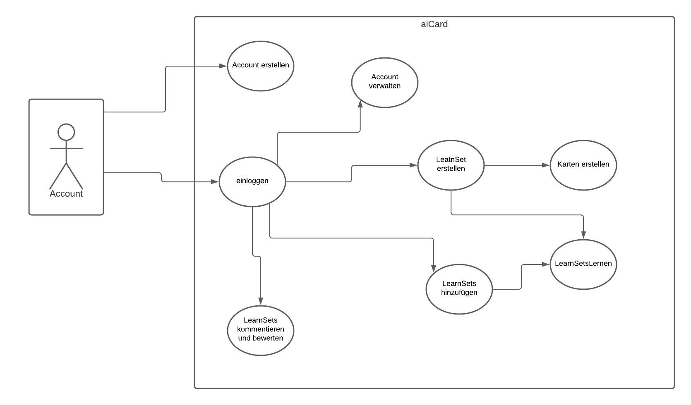
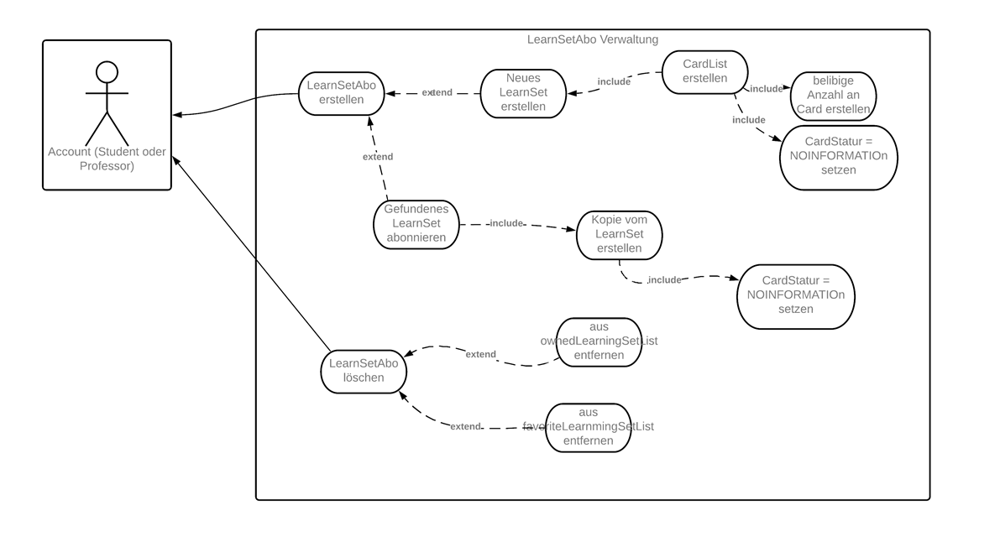
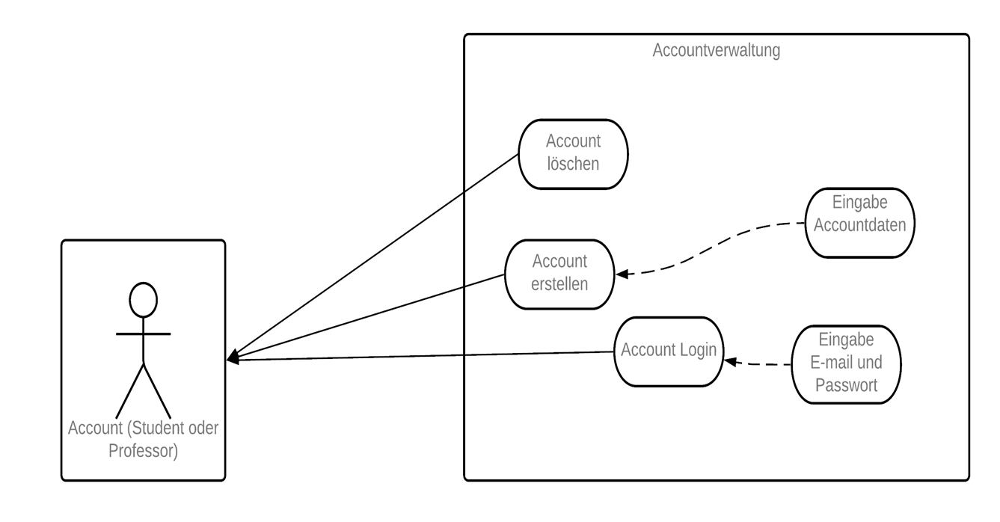
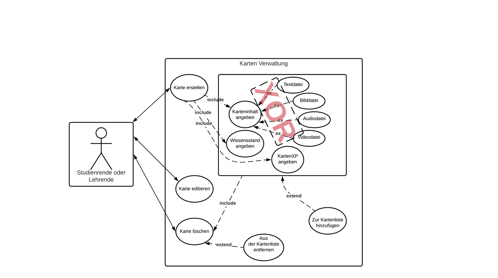
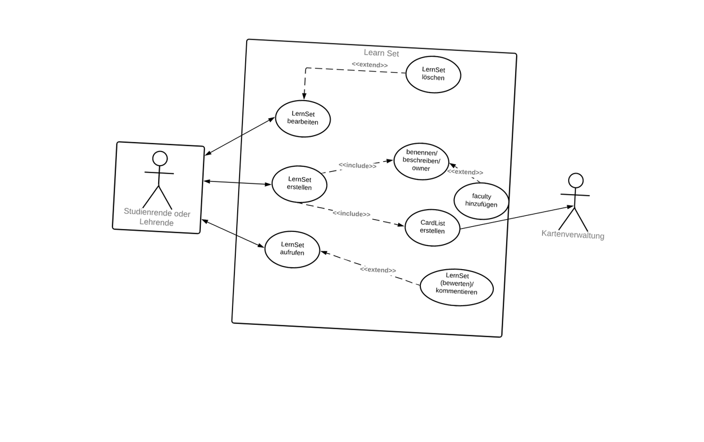
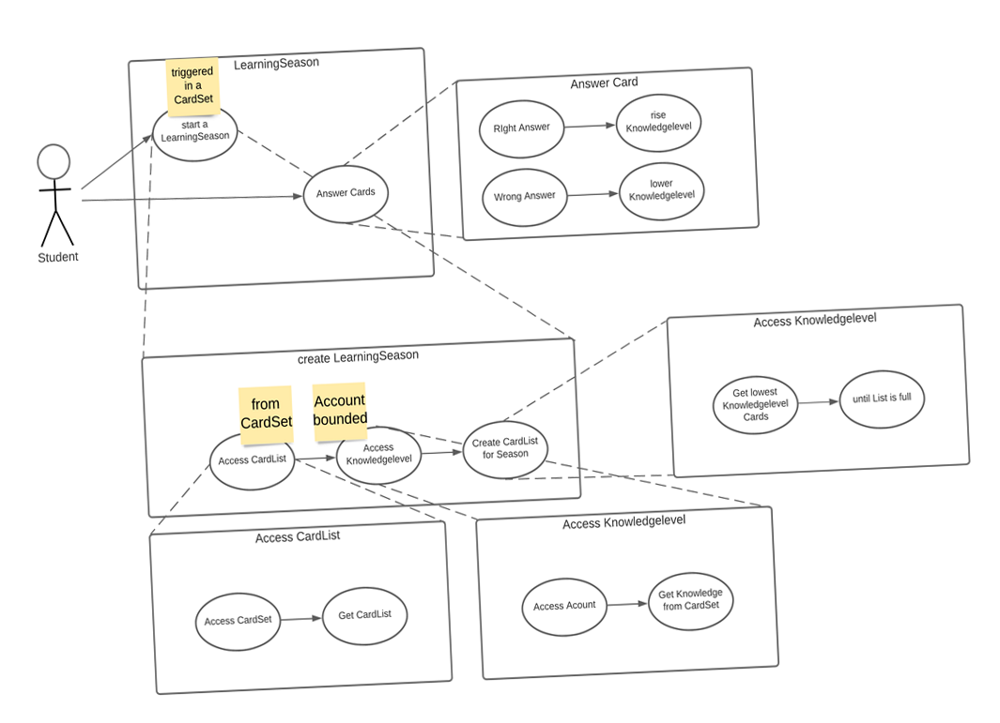
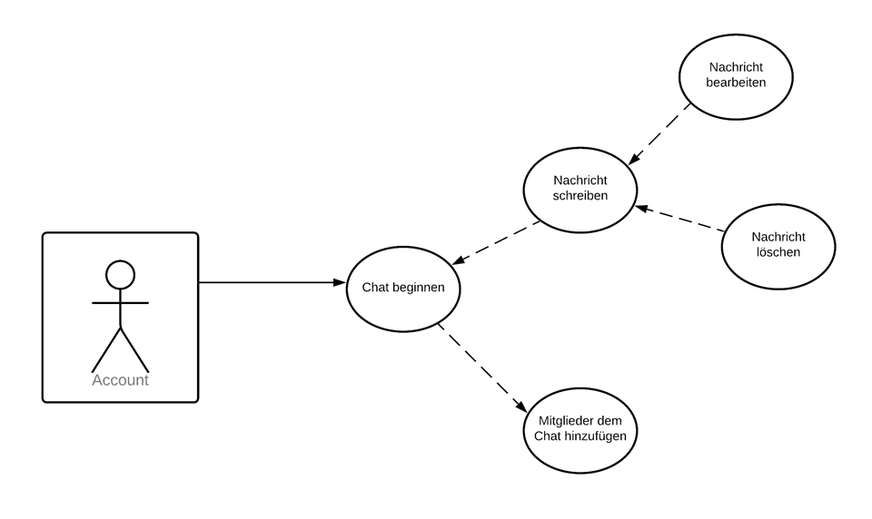
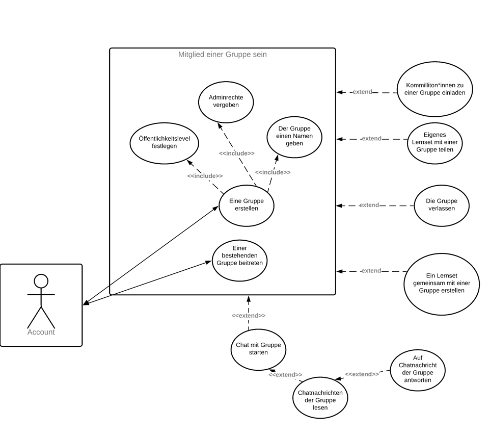
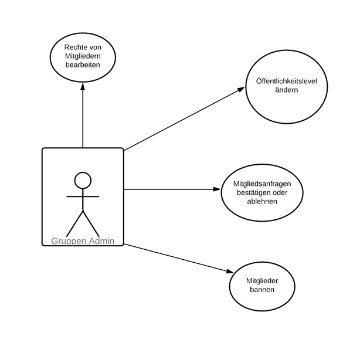
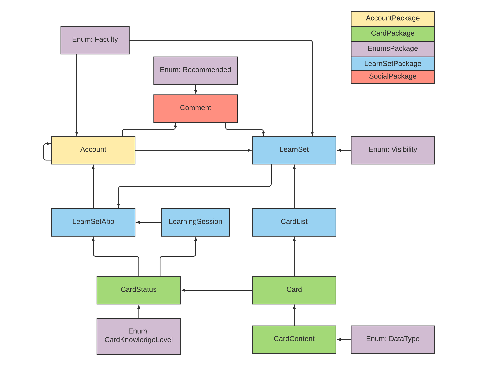

# AICard

## Dokumentation
Als Gruppenprojekt für die Veranstaltungen Java 1 und Java 2 wurde bzw. wird das im Weiteren beschriebene 
Multiuser-Lernkartensystem implementiert. 
Die Dokumentation der Abgabe Java 1 ist unverändert in diesem Dokument enthalten und ist mit den Unterüberschriften "Java 1" gekennzeichnet.
Wo Änderungen im Projekt vorgenommen wurden, wurden diese an der jeweiligen Stelle in einem weiteren Abschnitt "Java 2" erläutert.
Abschnitte ohne Konkretisierung waren entweder bereits in Java 1 enthalten, sind jedoch uneingeschränkt weiterhin gültig, oder sind im Projekt Java 2 neu hinzugekommen.

### TestAccounts
testAccount0@test.de - 123
testAccount1@test.de - 123
testAccount2@test.de - 123

### Hinweise zur Installation und Ausführung

Zur Ausführung der Applikation sind folgende Schritte zu befolgen:

- Zur Ausführung wird IntelliJ benötigt. 
- Das Projekt clonen und in IntelliJ öffnen.
- Im Projkt die pom.xml öffnen und Maven die Anhängigkeiten ziehen lassen.
- Die Datei src/main/java/de.aicard/core/PersistenceConfiguration.java öffnen. Dort sicherstellen, dass in der Methode additionalProperties() das Property "hibernate.hbm2ddl.auto" auf "create" gesetzt wird.
- Mit IntelliJ die AiCardApplication kompilieren und ausführen. 
- Falls Daten über Neustarts hinweg gespeichert werden sollen: Applikation schließen und das oben genannte Property auf "update" setzen.
- AiCardApplication erneut starten. 
- Das UI der Applikation kann dann über einen beliebigen Browser unter localhost:8080 erreicht werden.
- Zum Testen dürfen gerne die voreingestellten Testaccounts verwendet werden (siehe vorheriger Abschnitt dieser Dokumentation).
- Alternativ ist auch das Anlegen eines eigenen Accounts möglich (durch Navigation zu Log-In und dann Klick auf den Button "registrieren").
- Beispiel für zulässige Passwörter: 12asAs## oder 12ASas!?

### Allgemeine Projektübersicht

Projektteam

 

Das Team besteht aus 5 Mitgliedern, alle aus der Vertiefungsrichtung Ingenieursinformatik:
* **Clemens Berger** - [Profil](https://github.com/ClemensESB)
* **Antonio Blechschmidt** - [Profil](https://github.com/AntonioBlechschmidt)
* **Martin Kühlborn** - [Profil](https://github.com/KhbrnDev)
* **Daniel Michel** - [Profil](https://github.com/DanielMichel350)
* **Amine Semlali** - [Profil](https://github.com/AmineSemlali)

####Zuständigkeiten im Team:

- Amine Semlali: Domains, Repositories, Tests, Testdaten
- Antonio Blechschmidt: Frontend komplett
- Clemens Berger: Controller, Services, Models, Repositories, Testdaten
- Daniel Michel: Dokumentation, Services, Repositories, Tests
- Martin Kühlborn: Controller, Models, Services, Repositories, html, Spring Security, Testdaten

JavaDoc

 

[Hier](doc/JavaDoc/index.html) geht es zu unserer JavaDoc.

Projektbeschreibung

####Java 1

Ziel des Projektes ist es, ein Multiuser-Kartenlernsystem für Studierende und Lehrende als Pilotprojekt an der FH Erfurt
zu entwickeln. Um das System nutzen zu können, müssen die Studierenden und Lehrenden einen Account erstellen. Hierzu
sind die Angaben Hochschul-Email und Passwort zwingend erforderlich, da diese zum Login benötigt werden. Studierende
können sich ihrem Studienfach zuordnen. Alle können LearnSets anlegen. LearnSets sind eine Gruppierung von maximal 200 digitalen
Karten aus einem bestimmten Fachbereich. Ein LearnSet muss beim Erstelen benannt und beschrieben werden. 
LearnSets können als Sichtbarkeit entweder PRIVATE (nur der erstellende Account kann sie sehen und abonnieren), 
PUBLIC (alle können sie sehen und abonnieren) oder PROTECTED (der erstellende Account und alle Accounts in seiner
Freundesliste kann sie sehen und abonnieren) haben. Jede Karte im LearnSet besteht aus zwei Seiten, einer Vorder- und
einer Rückseite.
 
User können über eine Suchfunktion LearnSets finden, die für sie sichtbar sind, und sie zu ihrem Account hinzufügen
(abonnieren). Von abonnierten LearnSets aus können Abfragen gestartet werden, sogenannte Learning-Sessions. Beim Erstellen 
einer Learning-Session kann man auswählen, wie viele Karten in einer Abfrage abgefragt werden sollen: 10, 20, 30, 40 oder 50. Es werden automatisiert in einer LearningSession genau die Karten abgefragt, die über den niedrigsten Status verfügen.
Wird ein LearnSet neu abonniert, wird der Status jeder Karte auf diesen niedrigsten Wert gesetzt. Während einer LearningSession ist von dem Nutzer selbst anzugeben, ob er die Karte gewusst hat oder nicht. Anhand dieser Angabe wird der Status der Karte aktualisiert.
 
Accounts können Chats mit anderen Accounts erstellen und sich hierüber austauschen. Dem Austausch unter den Accounts dient
des Weiteren die Möglichkeit, LearnSets zu kommentieren und sie zu bewerten.

 
Ursprünglich wurde darüber hinaus überlegt, dem System eine Funktion hinzuzufügen, die es den Accouts ermöglicht, Gruppen mit anderen Accounts zu bilden und hierüber gemeinsam LearnSets zu erstellen.
Diese Funktion wurde jedoch nicht umgesetzt, da die Gruppe sich dazu entschied, lieber einen Fokus auf die Qualität der Kernfunktionen des Kartenlernsystems zu legen.
Gänzlich verabschiedet haben wir uns von dieser Funktion jedoch noch nicht - eventuell erfolgt eine Implementierung in Java 2.
Das bisher entstandene Grundgerüst der Gruppen-Klasse wurde im Projekt auskommentiert und alle vorhandenen Klassen wurden so gestaltet, dass eine Erweiterung des Gesamtsystems um eine Gruppen-Funktion ohne weiteres möglich ist. 

####Java 2

Die grundsätzliche Idee des Projektes hat sich seit der Projektabgabe Java 1 nicht geändert - jedoch sind neue Ideen hinzugekommen,
aus Zeitmanagementgründen wurden Ideen verworfen und die Komplexität der Klassen
wurde an manchen Stellen vereinfacht. Hier seien nur die Änderungen der vorliegenden
Abgabe im Vergleich zur Projektbeschreibung Stand Java 1 beschrieben. In allen anderen Punkten ist die Projektbeschreibung
Java 1 noch gültig. 
 
Beim Erstellen eines Accounts haben wir uns dazu entschlossen, mehr Angaben verpflichtend zu machen - die User müssen
nun also neben E-Mail Adresse (die entgegen des ursprünglichen Plans nicht zwingend die Hochschul-Mailadresse sein muss) und Passwort auch einen Namen angeben sowie eine Fakultät auswählen. 
Da die Unterscheidung zwischen Lehrenden-Accounts und Studierenden-Accounts wegfiel, gilt die zwingende Zuordnung zu einer 
Fakultät nun auch für Lehrende, nicht nur für Studierende. 
Auch bei Erstellen von Lernsets ist nun die Auswahl einer Fakultät erforderlich, um abonnierbare Lernsets übersichtlicher
im Learn Set Shop verfügbar machen zu können. Der Learn Set Shop realisiert die in der Projektbeschreibung Java 1
beschriebene Suchfunktion. Die Begrenzung von 200 Karten pro Lernset wurde aufgehoben.
 
Die für den Lernvorgang auswählbare Kartenzahl wurde reduziert auf maximal 25 Karten pro Learning-Session.
Hier kann nun zwischen 10, 15, 20 und 25 Karten gewählt werden. Hierdurch wird bewusst auf die bekanntlich kurze
Aufmerksamkeitsspanne von Studierenden und Menschen im Allgemeinen eingegangen. Enthält das Lernset weniger als die 
ausgewählte Kartenmenge, werden nur die existierenden Karten abgefragt. Enthält das Lernset gar keine Karten, wird der User auf die Seite /learnSets zurück geleitet. 
 
Die Möglichkeit des Chats zwischen Accounts wurde vom Team verworfen. Diese Funktion hätte den zeitlichen Rahmen des
Projekts gesprengt und ist zudem eine Funktion, die bereits durch viele andere Anbieter hinreichend realisiert ist.
Die Interaktion zwischen Accounts kann über das Bewerten bzw. Kommentieren von Lernsets erfolgen.

Eine Draufsicht auf die Möglichen Interaktionen zwischen User und System ist im folgenden Diagramm graphisch dargestellt.

 

Zur detailierten Funktionsweise der Klassen und Interaktionen der Klassen untereinander wurden weitere Entscheidungen getroffen,
die in der Dokumentation zu Java 1 so noch konkret beschrieben waren, die jedoch zur Nutzung des Systems relevant sind und daher hier aufgeführt werden:
- Learnsets haben genau einen Owner und können darüber hinaus mehrere Admins haben. Nur der Owner kann das Learnset bearbeiten und löschen.
Alle anderen Admins können nur Karten hinzufügen.
  
- Beim Erstellen eines LearnSets wird immer auch ein LearnSetAbo erstellt: ein Abo durch den LearnSetOwner. Wird das Lernset gelöscht, wird auch das Abo gelöscht.

- Die Visibility eines LearnSets entscheidet, ob LearnSets von anderen Accounts abonniert werden dürfen. Die Visibility eines Lernsets kann nachträglich bearbeitet werden. Dies führt dazu, dass zukünftig für das Lernset die neue Sichtbarkeit gilt.
Wird die Sichtbarkeit jedoch auf eine niedrigere Stufe als bisher verändert, bleiben aktive Abos des Lernsets bestehen, auch wenn sie der neuen Sichtbarkeit widersprechen.
  

- Zum Zeitpunkt der Projektabgabe Java 1 erhielten Accounts sowohl eine Liste "OwnLearnSets" als auch "LearnSetAbos". Die Liste "OwnLearnSets" wurde nun entfernt, da sie redundante Informationen enthält. OwnLearnSets sind LearnSetAbos, bei denen der Account auch Owner des zugehörigen LernSets ist.

  - Abgebrochene LearningSessions können nicht zu einem späteren Zeitpunkt fortgesetzt werden.

  - Beim Hochladen von Dateien für die Karten gibt es ein Datenlimit von 50mb. Dieses wird von JavaScript geprüft. Falls das Limit überschritten wird, gibt es ein JavaScript Alert und die Datei wird aus dem Input Feld entfernt.
  Diese Prüfung kann zwar umgangen werden, der Versuch des Hochladens einer größeren Datei führt jedoch nie zum Absturz des Servers. 
    Die Seite lädt dann lediglich nicht mehr.
    
- Einmal erstellte Karten können nicht bearbeitet werden, da sonst die Level der Karten in den LernSetAbos irreführend wären (die alte Karte wurde gewusst/ nicht gewusst, nicht aber die aktualisierte).
Ist der LearnSetOwner oder ein Admin des Lernsets mit einer Karte nicht mehr zufrieden, so kann er sie löschen und eine neue erstellen.
  
- Accounts haben eine Liste befreundeter Accounts. Freundschaften sind jedoch einseitig. Sie müssen nicht von dem anderen Account akzeptiert werden. Dies ist zweckdienlich, da die Freundesliste nur in zwei Bereichen relevant ist:
 nur Freunde können zum Admin eigener Lernsets gemacht werden und nur Freunde können eigene protected Lernsets abonnieren. Mit dem einseitigen Hinzfügen als Freund autorisiert ein Account andere genau hierzu.
  
- Wird ein Freund aus der Freundesliste entfernt, bleibt dieser Admin gemeinsamer Lernsets.
  
    

Use-Case-Diagramme

Die Folgenden Use-Case Diagramme zeigen den Stand bei Abgabe des Projektes Java 1. Die erfolgten Änderungen sind im Abschnitt
"Projektbeschreibung" sowie in der weiteren Dokumentation hinreichend beschrieben, weshalb hier auf weitere
detaillierte Use-Case-Diagramme verzichtet wird.

#### Account

#### Card

#### Learnset

#### Social

(noch) nicht implementiert:

Codestyle

Wir halten uns im Projekt an den allgemeinen Java Codestyle.

Verwendete Programme

 

* [IntelliJ](https://www.jetbrains.com/de-de/idea/) - IDE für JAVA
* [Discord](https://discord.com/) - Gruppenchat und Meetings
* [WebEx](https://www.webex.com/de/index.html) - Meetings, wenn der geteilte Bildschirm eine bessere Auflösung haben sollte
* [lucidchart](https://www.lucidchart.com) - Erstellung von Diagrammen
* [Office](https://www.office.com/) - Erstellung von Präsentationen
* [GitHub](https://github.com/) - Versionsverwaltung

### Zentrale Architekturentscheidungen

 Übersicht 

####Java 1

Im Laufe der Projektarbeit mussten in der Gruppe viele Entscheidungen getroffen werden hinsichtlich der Architektur des Systems,
es musste geklärt werden, wie die Klassen in Packages aufgeteilt werden sollen und welche Funktionalität in welcher Klasse am besten aufgehoben ist.
Die finale Struktur, die zum Zeitpunkt der Abgabe des Projekts für Java 1 vorliegt, ist das Ergebnis dieses Prozesses,
der mit folgendem Klassendiagramm, das auch in der Zwischenpräsentation des Projektes vorgestellt wurde, begann:

Am (vorläufigen) Ende dieses Prozesses steht nun das folgende Klassendiagramm, welches um eine bessere Übersicht zu
gewährleisten hier in verkürzter Version nur mit Klassennamen realisiert ist:

Die zentralen Entscheidungen, die zu diesem Ergebnis geführt haben, werden im Folgenden, geordnet nach Packages, dokumentiert.
Für die Dokumentation der konkreten Implementierung der Klassen ist bitte die unter Allgemeine Projektübersicht verlinkte JavaDoc sowie der Code selbst zu konsultieren.

####Java 2

Auch im Laufe der Arbeit im Rahmen des Projekts zur Lehrveranstaltung Java 2 wurden weitere Klassenanpassungen vorgenommen. 
Die Kernpackages, die Teil des Projektes Java 1 waren, wurden weiterentwickelt und angepasst, um sie im Rahmen des
Springframeworks nutzen zu können. In diesem Abschnitt werden nur die Klassen unter de.aicard.domains beschrieben. 
Auf die in Java 2 komplett neu hinzugefügten Komponenten wird in einem gesonderten Abschnitt eingegangen.
 
Das folgende Diagramm zeigt den finalen Stand unserer Klassen und Package-Aufteilung.
Welche Entscheidungen zu diesem Ergebnis führten, wird in den folgenden Abschnitten näher erläutert.

Enums

####Java1
Das Package Enums kam im Arbeitsprojekt als Package neu hinzu. Ursprünglich war geplant, die Enums funktional an die Packages
anzugliedern, wo sie benötigt werden. Wir haben uns jedoch dazu entschieden, alle Enums in ein eigenes Package auszulagern, 
da dies die Projektstruktur übersichtlicher gestaltet.

####Java2
Im Laufe des zweiten Java Semesters wurde die Enumerationen "AcademicGrade" und "State" entfernt und eine Enumeration "DataType" hinzugefügt.
Hintergrund sind Anpassungen in anderen Packages: der akademische Grad wurde durch Zusammenlegen von Student und Professor 
zu einem Account hinfällig. Der "DataType" wird nun als Enum erfasst, zuvor wurden hierzu mehrere Kindklassen der
Klasse "CardContent" zur Verfügung gestellt. Generell wird auf den Wegfall bzw. das Hinzufügen von Enums in den Packages, in denen sie genutzt werden bzw. nicht (mehr) genutzt werden, näher eingegangen.

Account

####Java1
Das Package Account erfüllt die Funktion der Nutzerverwaltung. Von Anfang an klar war, dass für diese Aufgabe drei Klassen zentral sind:
die Klasse Account, und, da es in einem Hochschul-Lernsystem zwei Typen von Accounts geben muss, die beiden Subklassen Professor und Student, 
die die Grundfunktionalitäten von Account erben, jedoch Besonderheiten für Lehrende und Lernende abbilden können.
Wo wir im Entwicklungsprozess eine Entscheidung treffen mussten, ist bei der Zuordnung von LernSetAbo und LearningSession:
beide Klassen enthalten zwar Informationen, die klar einem Account zugeordnet sind, da ein LearnSetAbo Repräsentation eines LearnSets und seiner Account spezifischen Informationen,
wie der akutelle Lernstand, ist. Eine LearningSession wird ebenfalls immer aus einem LearnSetAbo in einem Account gestartet.
Entsprechend könnten LearnSetAbo sowie LearningSession ebenso gut im Package Account enthalten sein. 
Die Gruppe entschied sich dennoch dazu, beide Klassen in das Package LearnSet zu inkludieren, um alle direkt mit dem LearnSet
zusammenhängenden Klassen, die die Funktion des Anlegens und Lernens von Inhalten erfüllen, zentral in einem Package zu haben.

####Java2
Im Laufe der Arbeit an Java 2 wurde durch die Gruppe diskutiert, ob die Unterscheidung zwischen den Klassen Student und Professor notwendig ist,
oder ob ein einheitlicher Account ausreichend ist. Grundsätzlich kann in einem Universitätslernsystem die Unterscheidung in diese beiden Gruppen Sinn machen,
beispielsweise wenn Studierende und Lehrende innerhalb des Systems unterschiedliche Rollen wahrnehmen sollen, mit denen unterschiedliche Rechte verbunden sind, 
oder wenn für die Funktionsweise des Systems spezifische Attribute von Bedeutung sind. So wäre beispielsweise in einem System, 
in dem es - wie auch ursprünglich für aiCard vorgesehene - Gruppen gibt möglich, Studierende anhand von Studiengang und Semester automatisch in Gruppen hinzuzufügen.
Im letztendlichen Funktionsumfang von aiCard machte eine Verschmelzung zu nur einer Klasse Account mehr Sinn, da der einzige Unterschied darin lag, dass Studierende einer Fakultät zugeordnet wurden und bei Lehrenden ein akademischer Grad erfasst wurde.
Das Erfassen der Fakultät ergibt jedoch für alle Accounts Sinn, während der akademische Grad keinerlei Funktion im System erfüllt.
Somit gibt es im finalen System nur noch eine Klasse "Account". Das Löschen des Enums "Academic Grade" war die logische Konsequenz aus dieser Änderung.

Learnset

####Java1
Die im vorherigen Abschnitt begründete Entscheidung führt dazu, dass das Package Learnset mehr Funktionen beinhaltet, nämlich all diejenigen, 
die unmittelbar mit der Funktionalität "Lernen" unseres Lernkartensystems zusammenhängen.
Dies beinhaltet auch die Klasse CardList, die in allen anderen Klassen des Package lernsets benötigt wird. Sie ist eine Liste von Karten,
angereichert durch einen Index, der erhöht und verringert werden kann, und so die aktuelle Karte anzeigt,
beispielsweise die Karte, die gerade in einer LearningSession angezeigt wird.

####Java2
In diesem Package wurde nur eine kleine Änderung vorgenommen: der Enum "State", der zuvor im LearnSetAbo genutzt wurde, wurde entfernt.
Der Hintergrund dieser Entscheidung ist, dass wir in Information letztendlich nicht genutzt haben. Dies bedeutet nicht, 
dass eine solche Information grundsätzlich nicht sinnvoll wäre, es ist sogar eine in Weiterentwicklungen des Systems durchaus denkbare Eigenschaft.
In der kurzen Projektzeit von einem Semester hätte sie jedoch den Rahmen gesprengt und ein Löschen der ungenutzten Information war die logische Konsequenz.

Card

####Java1
Wenn auch zum Lernbereich gehörend, haben wir uns dazu entschlossen, alle Funktionalitäten, die direkt mit einzelnen Karten zusammenhängen,
in ein weiteres Package auszulagern, um die einzelnen Packages kompakt zu halten. Bis auf die Auslagerung der Enums stand dieses Package in seinem
Umfang von Anfang an.

####Java2
Auch in diesem Package wurde eine Verschlankung vorgenommen. Im Laufe der Weiterentwicklung der reinen Klassenlogik hin zu einer
Webanwendung mit Datenbankanbindung haben wir bemerkt, dass es einfacher ist, nicht 4 unterschiedliche CardContent Typen zu haben.
Daher haben wir uns dazu entschlossen, in nur einer Klasse "CardContent" durch ein Attribut vom neuen Enum Typ "DataType" zwischen den verschiedenen Arten von Inhalten zu unterscheiden.
Dies trägt auch dem CleanCode Prinzip "Composition über Vererbung" Rechnung.

Social

####Java 1
Im Package Social mussten am meisten Entscheidungen getroffen werden, auch, weil von Anfang an der Fokus unserer Arbeit
auf dem Bereich des Lernens lag und weniger auf dem Bereich der Interaktion zwischen Accounts. Dennoch konnten wir letztendlich 
auch aus diesem Bereich einige Funktionalitäten implementieren, wie Chats und dem Kommentieren von LearnSets. Von anderen
Klassen mussten wir uns schließlich dennoch trennen. Von der Klasse Groups trennten wir uns, da die Implementierung der 
Funktion, Gruppen zu bilden, innerhalb eines Semesters nicht so möglich gewesen wäre, dass sie unseren Ansprüchen genügt hätte.
Und wir trennten uns von zwei weiteren Klassen, die ursprünglich im Package Social enthalten waren: MessageList und AccountList.
Hier stellten wir während der Implementierung fest: wir brauchen diese Klassen nicht, denn wir hatten an diese Klassen keine
Anforderungen, die nicht auch die Java eigene Klasse ArrayList erfüllen würde. Die logische Konsequenz war es, diese Klassen aus unserem Projekt zu löschen.

####Java 2
Auch im Projekt Java 2 lag unser Fokus auf unserer Kernidee, ein Kartenlernsystem zu entwickeln.
Die Interaktion zwischen Accounts wurde daher aus Zeitgründen weiter reduziert. Statt einer Klasse Chat und einer Klasse Message interagieren Accounts letztendlich über Kommentare zu Lernsets.
Hierfür gibt es eine neue Klasse "Comment". Ein Kommentar zu einem Lernset kann einmalig und dauerhaft mit einer Bewertung des Lernsets erstellt werden. Zur Bewertung wurde eine neue Enumeration "Recommended" hinzugefügt.

Neu in Java 2

Wir haben uns für die Bearbeitung der Aufgabenstellung in Java 2 dazu entschieden, eine Desktop Browser Applikation zu erstellen.
Die Daten hierzu werden in einer H2-Datenbank gespeichert. Zur Abbildung unserer Klassen auf die Datenbank haben wir uns für Hibernate im Zusammenspiel mit JPA entschieden.
Zur grundlegenden Strukturierung der Anwendung haben wir uns, wie in der Vorlesung vorgestellt, für das Spring Framework entschieden, konkret für die Verwendung von Spring MVC mit Spring Security.
Die zugehörigen JPA-Repositorys sind in der Projektstruktur unter de.aicard/storages zu finden. Die Logik und der Zugriff auf die Repositories wurde durch Services realisiert, die unter de.aicard/services platziert sind.
Die Controller sind unter de.aicard/controller zu finden. Wir haben im Projektverlauf auch eine Aufteilung nach Java1-Packages in betracht gezogen, wie es auch in vielen Tutorials praktiziert wird. Beispielsweise hätten wir das AccountRepository, den AccountService und den AccountController auch unter de.aicard/domains/account platzieren können.
Dies hätte unter Umständen Abhängigkeiten reduzieren können. Wir haben uns dennoch für diese Projektstruktur entschieden, da sie nach unserer Einschätzung genauso oft empfohlen wurde und uns als Team intuitiver erschien.
Für das Frontend haben wir uns für die Verwendung von Thymeleaf entschieden. Die Templates sind unter src/main/resources/templates zu finden.

### Lessons Learned

Der Entstehungsprozess dieses Projektes wurde auch begleitet von einem kontinuierlichen Lernprozess aller Gruppenmitglieder.
Da wir mit unterschiedlichen Vorkenntnissen in das Projekt starteten, konnten wir vor allem auch viel voneinander lernen.
Unsere Lessons Learned seien hier kurz zusammengefasst, gegliedert in den fachlichen Bereich und den sozialen Bereich.

 
Fachliche Lessons Learned

####Java 1
- Die größte Schwierigkeit bei diesem Projekt war das Umdenken von einer datenbankbasierten Logik: An der FH Erfurt lernen 
wir Softwaretechnik am Beispiel von Datenbanken, und mit diesem Denkmuster startete auch unsere Gruppe in das Projekt.
- Wir haben Java gelernt: trotz unterschiedlicher Vorkenntnisse haben am Ende doch alle etwas dazugelernt und ihre Kenntnisse
  in Java vertiefen können.
- Tests helfen sehr bei der Programmierung.
- Wir haben GitHub gelernt: Anfangs hatten wir einige Probleme beim Arbeiten mit GitHub, die wir jedoch alle gemeinsam lösen konnten.

####Java 2
- Wir haben im Laufe des Projektes festgestellt, dass Java Models viel mächtiger sind, als wir dachten, wodurch wir zunächst insbesondere beim Löschen komplizierter programmiert haben, als es nötig gewesen wäre. Dies haben wir bemerkt, und dann auch möglichst vereinfacht. Dabei sind wir jedoch auch an zeitliche Grenzen gestoßen, wodurch das finale Projekt immernoch an einigen Stellen einfacher sein könnte.
- Im Frontend sollte nichts gecasted werden.
- Thymeleaf, Spring MVC und alle anderen genutzten Technologien.

Soziale Lessons Learned

####Java 1
- Gruppenarbeit ist kompliziert, weil es viel Reden und Abstimmungen erfordert. Gerade im Online-Semester, wenn man sich nicht sowieso 
um die gemeisamen Veranstaltungen herum auf dem Campus trifft, ist dies eine besondere Herausforderung, die wir gemeinsam gemeistert haben.
- Wo viel miteinander geredet wird, ist eine gute und eindeutige Protokollführung sehr wichtig, damit Entscheidungen klar 
  dokumentiert sind.
- Wir sind mit Problemen nie alleine: egal welche (fachlichen) Probleme auftraten, es fand sich immer (mindestens) ein
  anderes Gruppenmitglied, das Abhilfe schaffen konnte. Egal, ob während den gemeinsamen Meetings oder einfach so zwischendurch
      in unserem Gruppenchat.
- Wir brauchen keine Sanktionen: wir hatten uns zu Beginn des Projektes, entgegen den Empfehlungen von Seiten des Dozenten,
  dazu entschieden, keine Sanktionen festzulegen. Hieran haben wir bis zum Ende festgehalten und haben gute Erfahrungen gemacht.

### Mögliche Verbesserungen und Weiterentwicklungen des Systems

- In einer zukünftigen Programmversion wäre zum Ende einer LearningSession das Anzeigen einer Auswertung denkbar, welche Karten gewusst wurden und welche nicht.
- In einer zukünftigen Programmversion könnte die Möglichkeit implementiert werden, abgebrochene LearningSessions zu einem späteren Zeitpunkt fortzusetzen.
- In einer zukünftigen Version könnte das Bearbeiten von Karten ermöglicht werden.
- Aktuell werden innerhalb einer LearningSession die Karten geordnet nach KnowledgeLevel abgefragt (zuerst niedrigstes Level). Dies könnte in einer zukünftigen Programmversion randomisiert werden.
- Das CardKnowledgeLevel könnte in einer zukünftigen Programmversion für den User angezeigt werden. Zurzeit wird es nur für interne Berechnungen verwendet.
- Die Methode zum Hinzufügen von Karten im AddCardController könnte verkleinert werden, indem pro Kartenseite nur ein TitleInput angegeben wird statt pro Kartentyp ein eigener Titel. Dies ist ein Relikt aus der Zeit, als die verschiedenen ContentTypen noch unterschiedliche Klassen waren. Dies würde auch eine Redundanz im Code beheben.
- Die html Seiten könnten in einer zukünftigen Version mehr Zurück-Buttons haben, um die Navigation über die Seite zu erleichtern.
- Eine zukünftige Programmversion könnte auch auf der CardOverview Seite einen Lernen-Button beinhalten.

### Bekannte Bugs, spezielle Features und offene ToDos

#### Bekannte Bugs

- SVG Bilder können in das System hinzugefügt werden, da sie ein "ImageType" sind, können aber nicht angezeigt werden.
- Beim Anzeigen von Karten können Audio und Video Dateien zurückgespult, aber nicht vorgespult werden.
- Die für die Karten hochgeladenen Dateien werden im Ordner "cardFiles" außerhalb der vorgegebenen Projektstruktur gespeichert. 
- Wir hatten Probleme, Controller Tests mit SpringSecurity zu schreiben. Für die Post-Requests konnten wir keine Lösung finden, wir bekamen immer Access Denied.
- 

#### Features

- Das Passwort der Testaccounts ist 123. 123 ist im System kein unterstütztes Passwort, das Erstellen eines eigenen Accounts mit diesem Passwort wäre nicht möglich. Zu Testzwecken haben wir jedoch dieses sehr schnell zu Tippende Passwort gewählt, um allen das Leben zu erleichtern.
- Die Datenbank ist nicht temporär, sondern wird in einem gesonderten Ordner (database) im Projekt gespeichert. Dies entspricht nicht der durch den Dozenten gewünschten Projektstruktur, ist jedoch so gewollt.
- In den Testdaten sind für die Lernkarten nur Text-Kontent vorhanden. Dies ist so gewollt, um die Größe des Repositorys zu reduzieren.

#### offene ToDos

- Möglichkeit, bei Neuerstellung der Datenbank die Dateien entsprechend zu bereinigen.
- Prüfen, ob das Prüfen der Existenz der Principals jedes Mal nötig ist, wenn man nur eine Seite laden möchte. Es handelt sich hierbei um ein Relikt der vor-Spring-Security-Vergangenheit.
- Das Prüfen, ob der Principal ein Account im Repository ist, führt dazu, dass der SpringSecurity User bei den Tests nicht darauf zugreifen kann, obwohl er autorisiert ist. Dies wurde zu spät bemerkt, weshalb die Controller Tests in diesen Fällen nur darauf testen, ob richtig redirected wird.

### Protokolle

Im Rahmen der Projektarbeit zu Java 1 wurden sehr intensiv Protokolle von Meetings erstellt. Mit der Zeit haben wir als Team jedoch festgestellt, dass wir mit weniger formalen Dokumentationen und Absprachen besser zurecht kommen.
Es fanden weiterin - die Prüfungsphase ausgenommen - mindestens wöchentliche Meetings statt, zwischen denen jedoch ebenso viel Kommunikation und Absprachen über unseren Discord Gruppenchat erfolgten. 
Die in Java 1 erstellten Protokolle landeten einmal erstellt im Repository und wurden bis zu ihrer Wanderung in die Dokumentation nicht mehr angetastet.
Daher haben wir uns gegen weitere Protokolle entschieden, da sie konkret für uns in genau dieser Gruppenkonstellation, nicht der beste Weg der Kommunikation darstellen. 

Meeting 5. November 2020

 

Protokoll

Meeting

Datum:05.11.20
Uhrzeit:18:00-19:20 Uhr

Teilnehmer:
Amine Semlali
Clemens Berger
Daniel Michel
Martin Kühlborn
Antonio Blechschmidt (Protokollant)

Inhalt:
regelmäßige Treffen Donnerstag 19 Uhr
keine Sanktionen für negative Verhalten, Überlegungen übe ein Belohnungssytem
Codstyle wird grob übernommen von Herr Sahms C++ Codestyle
Themenbesprechung:
Zahnarztorganisationssoftware
Burgerladenbestellsoftware
Karteikartensystem (gewähltes Thema)
Name für Projekt: aiCard
erstellen des Repository
testen der Funktionalitäten in GitHub

Aufgaben:
alle Mitglieder:
GitHub und IntelliJ zum laufen bringen
Beschreibung schreiben
Amine:
-
Clemens:
-
Daniel:
-
Martin:
Codestyle Sheet organisieren
Antonio:
Protokoll auf GitHub hochladen

Meeting 12. November 2020

 
Protokoll

Meeting

Datum:12.11.20
Uhrzeit:19:00 - 21:30Uhr

Teilnehmer:
Amine Semlali
Clemens Berger
Daniel Michel (Zukunfts Protokoll)
Martin Kühlborn (Protokollant)
Antonio Blechschmidt (verspätet)

Inhalt:
Projektbeschreibung überarbeiten und Festlegung der Projektideen
Erstellung der PowerPoint für die Präsentation am 16.11.20

Aufgaben:
alle Mitglieder:

    Amine:
        -Präsentation Folie 6
    Clemens:
        -Präsentation Folie 3
    Daniel:
        -Description verschönern 
		-Präsentation Folie 4
    Martin:
		-Präsentation Folie 5
    Antonio:
		-Präsentation Folie 1 und 2

Meeting 19. November 2020

 
Protokoll

Meeting

Datum:19.11.20
Uhrzeit:19:00 - 22:00Uhr

Teilnehmer:
Amine Semlali
Clemens Berger (Protokollant)
Daniel Michel (Verspätet)
Martin Kühlborn
Antonio Blechschmidt

Inhalt:
Klassen und Methoden Identifikation

Aufgaben:
alle Mitglieder:
Die denken Nach und Atmen

    Amine:
        Hat Link für UML Diagramm
        Card
    Clemens:
        Skipper
    Daniel:
        LearnSet
    Martin:
		Account
    Antonio:
		LearningSession

Meeting 26. November 2020

 
Protokoll

Meeting

Datum: 26.11.2020
Uhrzeit: 19:00

Teilnehmer:
Amine Semlali
Clemens Berger
Daniel Michel (Protokoll)
Martin Kühlborn
Antonio Blechschmidt

Inhalt:
- Aktueller Stand Klassen
- Skipper-Problem
- Dokumentation
- Ziele bis nächste Woche

Status:
- LearnSet Status: Status, wenn nicht neu: Prozentzahl wird angezeigt

Dokumentation:
- 1. Foliensatz, Seite 14

Optionaler Termin bei Problemen: Montag Abend

ToDo:
- Klassen aufeinander abstimmen
- @Daniel Konstruktor LearnSet bezüglich State überarbeiten
- @Clemens neue Klasse CardList
- @all Code dokumentieren
- @Daniel Enums auslagern
- @Daniel Nachfragen, ob Rücksprache mit Dozent möglich

Meeting 3. Dezember 2020

 
Protokoll Meeting

Datum: 03.12.2020
Uhrzeit: 19:00

Teilnehmer:
Amine Semlali (Protokoll)
Clemens Berger
Daniel Michel
Martin Kühlborn
Antonio Blechschmidt

Inhalt:
- Änderung Stand Klassen : Constructor Learnset ändern
- Fragen
- Ziele bis nächster Montag

Fragen für Montag :
-	Datenbank implementieren ?
-	Wie viele Klassen brauchen wir für 5 Personen ??
-	Jeweils eine Klasse für Vorder- und Rückseite der Karte ?
-	Fotos auf Karten ?
-   Welche Kriterien/Themen gibt es für die Zwischenpräsentation?
-   Enums als Klasse so ok?

ToDo: bis Montag 07.12.2020
- @Martin : Enum Klasse (Studiengänge)
- @alle : sich informieren über Logger Klasse + Test Fälle schreiben
-  sich über UML Diagramm informieren (wie macht man das richtig)

Meeting 7. Dezember 2020

 
Protokoll

Meeting

Datum:07.12.2020
Uhrzeit:19:00-21:30 Uhr

Teilnehmer:
Amine Semlali
Clemens Berger
Daniel Michel
Martin Kühlborn
Antonio Blechschmidt (Protokollant)

Inhalt:
Diskusion neue Klassen
(EnumKlassen)
State
CardKnowledgeLevel
Fakultäten
Studiengänge
(abstrakte)Karteninhalt - Superklasse der MedienKlassen
TextKartenSeite
AudioKartenSeite
BildKartenSeite
VideoKartenSeite
(abstrakte)AccountKlasse aufspalten
Student - Semester
Dozent - Administrative Funktionen
ChatKlasse mit ArrayKommentare
KommentareKlasse - für CardSets, Cards
LearningGroupKlasse - alle Können karten erstellen
LearnSet AccountArray für eine Whitelist
CardProgress - Knowlegdelevel, Status Auslagern in eine Klasse die Accountgebundene Card/Cardset festhält
Array mit Knowlegdelevel
Array mit Status
KlassenDiagramm in lucidchart (https://lucid.app/lucidchart/c7963545-5f00-46cf-94dc-b8bf282ebe30/edit?shared=true&page=HWEp-vi-RSFO#?folder_id=home&browser=icon )

Aufgaben:
alle Mitglieder:
Use-Cases überlegen
Amine:
Card
Clemens:
Learnset und Cardlist
Daniel:
Roter Bereich in lucidchard
Martin:
Gelber Bereich in lucidchard
Antonio:
LearningSeason

Meeting 10. Dezember 2020

 
Protokoll

Meeting

Datum:12+13.12.2020
Uhrzeit:19:00-21:00 Uhr

Teilnehmer:
Amine Semlali
Clemens Berger
Daniel Michel
Martin Kühlborn	(Protokollant)
Antonio Blechschmidt

Inhalt:
Präsentation erstellen für Zwischenpräsentation

Amine:
Card(6+7)
Antonio:
Lernsets(8+9)
Clemens:
Account(4+5, 12)
Martin:
Einleitung (1,2,3)
Daniel:
Chats(10+11)

@all:
Sonntag 19:00Uhr treffen und Präsentation durchsprechen

Meeting 17. Dezember 2020

 
Protokoll

Datum: 17. Dez 2020
Uhrzeit: 19:17 Uhr bis 19:47 Uhr

Anwesend: Alle :)

Themenverteilung:
CardStatus, Card und das rechts davon: Martin
LearnSet, LearnSetAbo, LearningSession: Daniel
Account, Student, Professor: Clemens
AccountList, Groups, LearnSetAbo: Amine
Antonio: Dokumentation

Code-Review-Kreis: Martin-> Daniel -> Clemens -> Amine -> Martin

und Antonio rewied alles

Nächste Meetings: Mittwochs, 19 Uhr

Meeting 23. Dezember 2020

 
Protokoll

Meeting

Datum:23.12.2020
Uhrzeit:19:00-19:38 Uhr

Teilnehmer:
Amine Semlali
Clemens Berger (Protokollant)
Daniel Michel
Martin Kühlborn
Antonio Blechschmidt

Inhalt:
LearnSetAbo
Problembesprechung

Aufgaben:
alle Mitglieder:
-
Amine:
-Message MessageList
Clemens:
-
Daniel:
-
Martin:
-
Antonio:
-

Meeting 30. Dezember 2020

 
Protokoll

Meeting

Datum:30.12.2020
Uhrzeit:19:00-19:38 Uhr

Teilnehmer:
Amine Semlali (Protokollant)
Clemens Berger
Daniel Michel
Martin Kühlborn
Antonio Blechschmidt

Inhalt:

Tests schreiben
Klassen vervollständigen

Aufgaben:

    alle Mitglieder: Eigene Klassen vervollständigen

    Amine: Tests für AccountList, Group, Chat, MessageList, Message

    Clemens: prüfen ob unser Code folgt die Javacode conventions, Erweiterung der Beschreibung

    Daniel: Tests für Learningsession und Learnsetabo

    Martin: Tests für Cardlist, Cardstatus und Learnset

    Antonio: Tests für Account und Funktionen

Meeting 7. Januar 2021

 
Meeting

Datum:07.01.2021
Uhrzeit:19 Uhr

Teilnehmer:
Amine Semlali
Clemens Berger
Daniel Michel
Martin Kühlborn
Antonio Blechschmidt (Protokollant)

Inhalt:
besprechen von Problemen
überarbeiten von Klassen anhand von fehlschlagenden Tests
account.creategroup() 2. Constructer
leanset.learnset() parameter übergeben
owner von Account übergeben
LearnsetAbo int für Evaluation

Aufgaben:
alle Mitglieder:
m_ für alle Member
Test schreiben
Amine:
-
Clemens:
-
Daniel:

    Martin:

    Antonio:

Meeting 14. Januar 2020

 
Meeting

Datum:14.01.2021
Uhrzeit:19 Uhr

Nächstes Treffen: Montag, 18.01.2021 19:00UHR

Teilnehmer:
Amine Semlali
Clemens Berger
Daniel Michel
Martin Kühlborn (Protokollant)
Antonio Blechschmidt

Inhalt:
Problembehandlung Chat
Gruppe wird nach hinten verschoben

Ideen für die Dokumentation:
Löschbare Nachrichten im Chat

Aufgaben:
alle Mitglieder:
- TODOS in eingenen Klassen bearbeiten
- Bei Gettern NullPointerExceptioons hinzufügen
-
Amine:
-
Clemens:
-
Daniel:

    Martin:

    Antonio:

Meeting 18. Januar 2021

 
Meeting

Datum:18.01.2021
Uhrzeit:19 Uhr

Nächstes Treffen:

Teilnehmer:
Amine Semlali
Clemens Berger
Daniel Michel (Protokollant)
Martin Kühlborn
Antonio Blechschmidt

Inhalt:
Dokumentation

Funktionalitäten, die wir noch brauchen:
- generelle Suchfunktion

Aufgabe:

Clemens überarbeitet die Klassen in Doku.
alle anderen: ToDos abarbeiten, Fehler in Tests beheben, weitere Tests schreiben, Code-Dokumentation in Englisch und
Java-Code-Standard

Meeting 21. Januar 2021

Meeting

Datum:18.01.2021
Uhrzeit:19 Uhr

Nächstes Treffen:

Teilnehmer:
Amine Semlali
Clemens Berger
Daniel Michel (Protokollant)
Martin Kühlborn
Antonio Blechschmidt

Inhalt:
Dokumentation

Funktionalitäten, die wir noch brauchen:
- generelle Suchfunktion

Aufgabe:

Clemens überarbeitet die Klassen in Doku.
alle anderen: ToDos abarbeiten, Fehler in Tests beheben, weitere Tests schreiben, Code-Dokumentation in Englisch und
Java-Code-Standard

Meeting 25. Januar 2021

 
Meeting

Datum:25.01.2021
Uhrzeit:19 Uhr

Nächstes Treffen: Donnerstag, 28.01.2021 19:00UHR

Teilnehmer:
Amine Semlali (Protokollant)
Clemens Berger
Daniel Michel
Martin Kühlborn
Antonio Blechschmidt

Inhalt:
To Do reviews
Code review

Aufgaben:
alle Mitglieder:

Argumente von Funktionen mit _ anfangen
Eigene Klassen anpassen
Tests schreiben
Todos bearbeiten
Codestyle respektieren
Klassendiagramm updaten
Dokumentation

Meeting 28. Januar 2021

 
Meeting

Datum:28.01.2021
Uhrzeit:19 Uhr

Nächstes Treffen:

Teilnehmer:
Amine Semlali
Clemens Berger
Daniel Michel
Martin Kühlborn (Protokollant)
Antonio Blechschmidt

Inhalt:
PowerPoint Präsentation
Problemen fixen im Test

Aufgabe:
@all:
Ideen für Präsetation
@Amine:

	@Clemens:
		DIAGRAMME ! ! !!!
	@Daniel:
		
	@Martin:
		
	@Antonio:
		Account und AccountTest fixen

Meeting 20. Mai 2021

Meeting Protokol 20.05.21 18 Uhr

Ablauf
Stand des Projekts
Aufgaben bis Präsentation
Front-end Martin, Antonio (Fr)
Spring & Test Clemens, Amine, Daniel (Sa Meeting 15 uhr)
Account Clemens
Social Amine
Rest Daniel ( kann Zeug noch abgeben)

nächstes Meeting Montag 15Uhr

